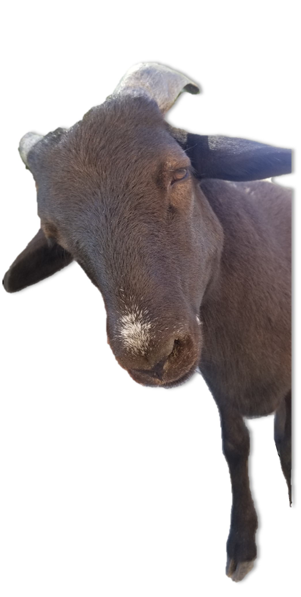

## Various Microbial Ecology Projects {.unnumbered}

<https://kellifeeser.github.io/black-sheep-club/>

\
\

```{r render-site, include=FALSE,eval=F}
library(rmarkdown)
library(bookdown)
#knit this then commit and push

#render homelink
# rmarkdown::render("homelink.Rmd", output_file="/Users/L347123/Desktop/black-sheep-club/code/homelink")

#render index_Danae.Rmd
rmarkdown::render("DanaeB_dataset/code/index_Danae.Rmd", output_file="/Users/L347123/Desktop/black-sheep-club/docs/index_Danae")

rmarkdown::clean_site(preview = TRUE)
```


Danae, Pilar and others <a href="index_Danae.html" target="_blank">click here for current diversity paper analyses</a>.

\
\

# **BFI workflow templates in-progress**


<a href="1_ReadProcessing_Danae_B_kf_TEMPLATE_1_seqprocessing.html" target="_blank">Module 1: Sequence Processing</a>\
  
<a href="1_ReadProcessing_Danae_B_kf_TEMPLATE_2_OTUfiltering.html" target="_blank">Module 2: OTU Filtering</a>

\
\
\
\
\
\
\
\
\
\
\
\
\
\
\
\
\
\

{width="1in"}


